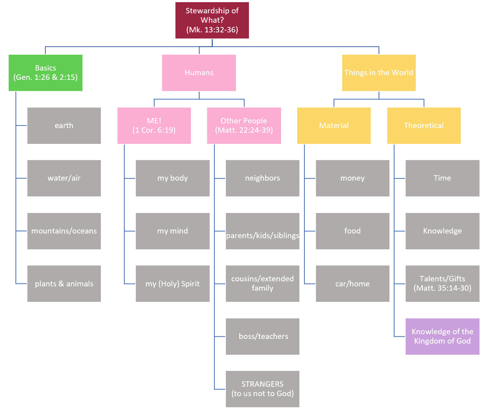

<body> <h1> 

“Stewardship is the heart of God” 
</h1></c> </body>

<body> <i> 

-Pastor Mike Todd, Transformation Church
</i> 
 </body>

<b>

1.  What is God asking you to be a steward of in this season?

2.  What is God asking you to be a ***BETTER*** steward of in this season? 
</b>

<u>
Steward: </u>
<i>

- a person who looks after the passengers on a ship, aircraft, or train and brings them meals, takes care of their domestic affairs.
- a person who manages another's property or financial affairs; one who administers anything as the agent of another or others.
- a person who has charge of the household of another, buying or obtaining food, directing the servants, etc.
</i>

<u>
Stewardship: </u>

<i>

- the job of supervising or taking care of something, such as an organization or property
- manage
- managers
</i>